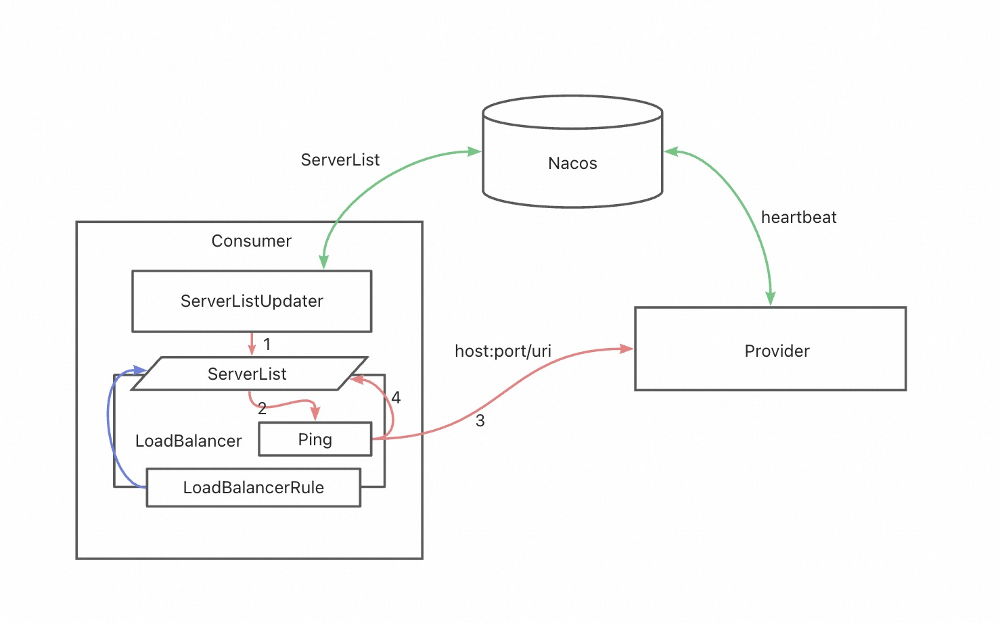

# CloudApp Microservice Ribbon Ping Demo

## 项目介绍

在应用程序运行中，由于各种不可预知因素如K8S应用的节点失联、节点负载过高、或未处理的程序异常，可能出现应用进程假死无法提供服务的情况。
而此时如果服务端实例与注册中心的心跳检查线程仍然正常，则注册中心无法将该异常实例从注册中心中移除，客户端流量分发到该实例则会出现访问报错。

本Demo项目描述了如何使用 SpringCloud 框架下 Ribbon 负载均衡器的 Ping机制 中 PingUrl实现 来探测服务端实例是否可用。

## 项目依赖版本

- Spring Boot：2.1.0.RELEASE
- Spring Cloud：Greenwich.SR3
- Spring Cloud Alibaba：2.1.0.RELEASE

## Ribbon Ping机制 流程概述

流程一：服务端实例上报心跳；客户端实例订阅服务的实例列表 ServerList 。

流程二：客户端存在 ServerListUpdater 定时（每30s）更新客户端负载均衡器缓存的 ServerList（所有实例），更新时如果启用了 Ping机制 ，则会强制做ServerList的Ping检查，如上图所示的PingUrl实现检查，根据Ping返回结果缓存实例存活状态。

流程三：客户端负载均衡器根据负载均衡策略（如RoundRobinRule），在基础的轮询策略执行完毕后，额外进行存活判断，如果实例未就绪，则重新执行轮询选择流程，直到找到可用的实例（Ping结果存活）。

## PingUrl

在客户端负载均衡器拉取到注册中心服务的实例列表后，获取该实例注册的Host和Port作为endpoint，并支持指定访问URI来进行健康检查。

### 可配置参数
- pingAppendString：指定健康检查的URI，如果未填则默认为""。
- isSecure：指定是否开启安全访问，如果配置为true，则进行健康检查的schema切换为https，默认值为false。
- expectedContent：根据响应内容进行可用性判断。若未指定，则根据响应状态码判断，状态码200则认为检测通过；若指定了，则根据响应内容与配置内容是否一致，判断是否可用。

## Demo 接口说明

### 服务端
服务端 Demo (cloudapp-microservice-springcloud-provider) 提供的健康检测接口 /healthCheck 的返回值支持由/offline、/online接口动态控制

- GET /online : 模拟实例上线，/healthCheck接口返回 true。
- GET /offline : 模拟实例下线，/healthCheck接口返回 false。
- GET /healthCheck : 返回当前实例是否可用。
- GET /address : 返回实例当前IP地址。

### 客户端
- GET /address : 调用服务 /address 接口。